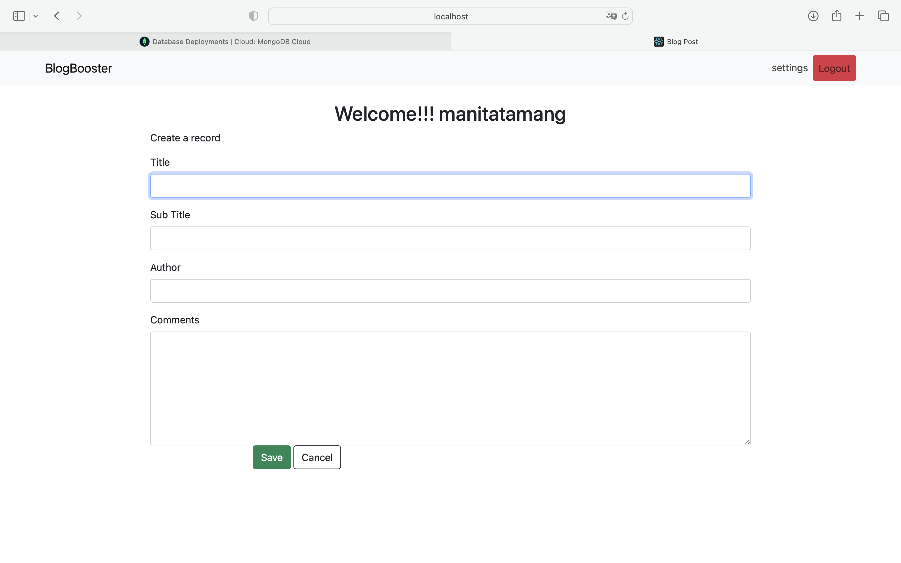

Module Title - Advanced Database Systems
Module Code - COM519
Module Leader - Joe Appleton

Link to github repository - https://github.com/5tamam00/Project-COM519
Link to the website - http://localhost:3000

**Table of Content**
1. Introduction
2. System Overview
3. Database Design
4. Failed Task
5. Conclusion and Reflection

1. Introduction
This is a very simple project. It is about the blog website. The reason for me to choose this is because usually I read blogs for most of school work and for other stuff as well. So I thought maybe I could do something about it and see if I could do create a website and post a blogs and manage those blogs.
I looked into kaggle for datasets and to get some ideas for the project but they were all big and I could not analysis those dataset so I decided to do something simple which was not that simple. 
I tried on creating, editing, deleting a blog post with the dataset that I manually created.

1. System Overview
   
   This is the main page of the website with the login details to fill up. Before login there are two function "Home" and "Login". "Login" will connect to the same page where as "Home" will take as to a different web page with the list of blogs that has been uploaded with author name, posted date, count likes as well. It shows as follow:
   
   After you login with username and password you will be directed to a different web page with various functions.
   .
   Here we can create a blog post with title, subtitle, comments and author. We can also edit/update/delete the post by clicking on the button as represented. Updating page look as follow:
   
   Finally creating a record page looks as follow:
   .

2. Database Design
   I tried using mongodb to create a database but I wasnot able to do it. So I tried with sqlite which we learned last semester. 
   I created a database called "database.db" which was created with id, author name, title, subtitle.
   .
   As we can see there is a function of created date and update date with default current timestamp which makes us easier to know the exact time of the creation/update of the post as a reader as well/

3. Failed Task
   - The "settings" button will be creating a new record which should not be doing that
   - The "home" page is not much clearer because of the styling, all the information about the post is somewhat overlapped.
   - Did not use mongodb for a dataset.
   - Probably no proper README.md file.

4. Conclusion and Reflection
   I tried on different ideas and datasets but I could not come up with any analysis and had not idea what was I supposed to do with those data. I lost most of the time during this stage where I was all over the place for the ideas. I struggled a lot with the mongodb on creating the datasets and spend a bit more here. To be honest, in this project most of the things I did were from google, your notes, videos. I tried to understand the concept which always did not seem to work. 